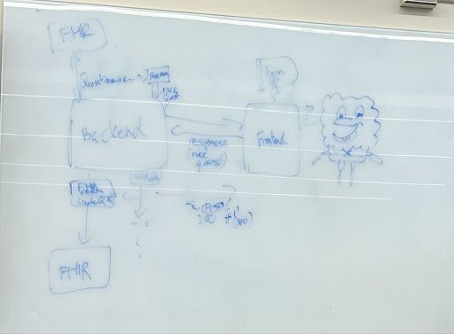

# Dream Team's Meeting Notes

### Sept 20 - 24

- Discussed the preferred projects and submitted them ranked through top 3
    - Prioritized the health projects because of our preference to work with a 4th member
    - Wanted to be able to branch out on different technologies / areas of development
      -Patrick wanted to be able to learn more backend!
- Discussed preferred meeting times and locations for both the TA weekly meetings and to begin work on assignment 1
- Completed primer for FIHR and took notes on it for future reference
    - Learned that back-end development will likely center around the conversion of FHIR Questionnaire data into forms, and then converting the answers into QuestionnaireResponse format
    - We noticed that because of the type of work we’re doing, we will need to validate our solutions more.

### Sept 29
- Started work on Assignment 1:
    - Talked about team expectactions and roles
    - Discussed what the project is about and how we plan to solve the problem presented to us
    - Discussed a development plan that will feature three milestones that we will attempt to meet
    - Discussed a tech stack that the team is comfortable with and that will work well with the expectations of the project
- Decided that we will meet once a week to discuss team progress so that we can all align eachother on what we are each working on

### Sept 30
- Met with the TA to discuss:
    - How we as individuals are feeling about the course
    - If we have met to discuss A1 and team roles and expectations for future work and meetings
 - Met async with the industry partner for our project and had him look over our milestones for the project to verify that it is both fair and realistic within the given time frame
     - He agreed that we set out a good plan for the rest of the semester and gave good tips for some of the stuff we wrote 

### Oct 07
- Met with TA Julia:
    - Talked about A1 marking and what we can expect in terms of A2
    - Discussed how each group member felt about A1 and their own individual contributions and next steps
- Concerns:
    - Very similar open source tools already exist that do what we are trying to accomplish with this project. We do not think we will be able to build a better tool compared to those given we have such a limited amount of time.  

### Oct 13

- Reassessing and confirming goals/features discussed in a1
- Took a look at Formik docs, confirmed that it fits our use case
- Next steps:
    - Rishab will read up on FHIR
        - Complete by: Oct 20
    - Rish/Pat setup query to get Questionnaires and pass to frontend
        - Validate response from server
        - Test
        - Complete by: Oct 25
    - Kevin setup initial landing page and search bar/dropdown so user can select a questionnaire
        - Hardcode list of questionnaires at first until step 2 is complete
        - Complete by: Oct 27
    - Kevin: Integrate Questionnaire list using id’s from step 2
        - Test
        - Complete by: Oct 28
    - Rish/Pat setup query to get questionnaire based on ID selected by user in frontend 
        - Can be a hardcoded ID in beginning so not blocked 
        - Complete once step 4 is done
        - Complete by: Oct 31
    - Tiago: setup page to render form components based on questionnaire Object selected
        - Wait until 5 is completed 
        - Complete by: Nov 4

- Set up github issues for next steps: https://github.com/TiagoF99/CSC302-Patient-Questionnaire/issues
- Potentially important resources we found:	
https://docs.smarthealthit.org/client-js/
https://github.com/Vermonster/fhir-kit-client

### Oct 20

- Weekly Updates:
    - Tiago:
        - Completed:
            - All Questionnaire types: https://www.hl7.org/fhir/valueset-item-type.html
            - [PR](https://github.com/TiagoF99/CSC302-Patient-Questionnaire/pull/6): 
                - Added button to switch between page where you search for a questionnaire and page that renders questionnaire in form
                - Added basic formik form
            - [PR](https://github.com/TiagoF99/CSC302-Patient-Questionnaire/pull/8):
                - Added frontend API methods to get a questionnaire based on its ID
                - Added error message components if the above fails
                - Added components to render a form based on a questionnaire and get inputted values for most questionnaire item types
        - Next Steps:
            - Finish questionnaire to form integrations for the rest of the questionnaire types
    - Patrick
        - Completed:
        - Next Steps:
    - Kevin
        - Completed:
            - Started working landing page with search button
        - Next Steps:
            - Need more time to complete current task
    - Rishab
        - Completed:
        - Next Steps:

- System diagram we came up with:

- Important findings/decisions:
    - Send a questionnaire as a schema from the BE to FE using https://github.com/dermatologist/fhirformjs
    - Render the questionnaire schema using https://github.com/dermatologist/fhir-questionnaire-render-react/ on the front end
    - Validation will have to be done by us without use of library

### Oct 21
- Met with TA Julia:
    - Talked about how we have started A2 and have some working features currently
    - We individually spoke about what we have been working on and what we have found has been going well and not going well technically
        - Tiago:
            - Frontend work has been going well but some challenged with setting up FHIR and all of its formatting and type restrictions
        - Kevin:
            - Working on setting up the landing page
        - Rishab:
            - Working on setting up the backend and researching different tools that we could leverage for our project
        - Patrick:
            - Team had a hard time figuring out project scope but have a clear understanding after team weekly meeting
            - Working on the backend alongside Rishab and is new to alot of the technologies being used, so needs some ramp up time  
    - Things to note:
        - Improve meeting notes to include meetings with industry partner
        - Professor will doc marks for not showing up to TA meetings 

### Oct 27

- Weekly Updates:
    - Tiago:
        - Completed:
            - [PR](https://github.com/TiagoF99/CSC302-Patient-Questionnaire/pull/9):
                - Integrated Group item type properly
                - Updated styling and added a global header
                - Added for item value verifications  
        - Next Steps:
            - Integrate open-choice, question types for form 
    - Patrick
        - Completed:
        - Next Steps:
    - Kevin
        - Completed:
        - Next Steps:
    - Rishab
        - Completed:
        - Next Steps:

### Oct 28
- Met with TA Julia:
    - Talked about previous issues with project scope and how they are mostly resolved now
    - Not much project progress this last week given other priorities
    - Kevin made some progress on his end this week given he did not do much the previous week
    - All team members said what has been going well technically and was has not been going so well
        - FHIR server was down for a period of time when developing this week
    - Discussed team progress and where we are at with milestones
    - Things to note:
        - Improve meeting notes to include meetings with industry partner
        - Professor will doc marks for not showing up to TA meetings 
