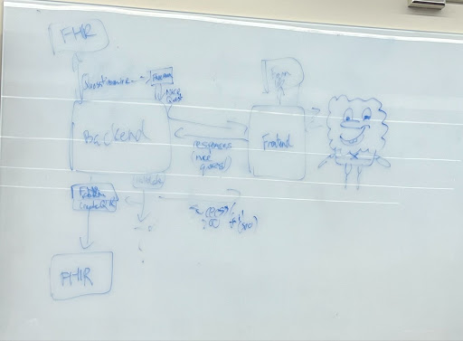

# Dream Team's Meeting Notes

### Sept 20 - 24

- Discussed the preferred projects and submitted them ranked through top 3
  - Prioritized the health projects because of our preference to work with a 4th member
  - Wanted to be able to branch out on different technologies / areas of development
    -Patrick wanted to be able to learn more backend!
- Discussed preferred meeting times and locations for both the TA weekly meetings and to begin work on assignment 1
- Completed primer for FIHR and took notes on it for future reference
  - Learned that back-end development will likely center around the conversion of FHIR Questionnaire data into forms, and then converting the answers into QuestionnaireResponse format
  - We noticed that because of the type of work we’re doing, we will need to validate our solutions more.

### Sept 29

- Started work on Assignment 1:
  - Talked about team expectactions and roles
  - Discussed what the project is about and how we plan to solve the problem presented to us
  - Discussed a development plan that will feature three milestones that we will attempt to meet
  - Discussed a tech stack that the team is comfortable with and that will work well with the expectations of the project
- Decided that we will meet once a week to discuss team progress so that we can all align eachother on what we are each working on

### Oct 13

- Reassessing and confirming goals/features discussed in a1
- Took a look at Formik docs, confirmed that it fits our use case
- Next steps:

  - Rishab will read up on FHIR
    - Complete by: Oct 20
  - Rish/Pat setup query to get Questionnaires and pass to frontend
    - Validate response from server
    - Test
    - Complete by: Oct 25
  - Kevin setup initial landing page and search bar/dropdown so user can select a questionnaire
    - Hardcode list of questionnaires at first until step 2 is complete
    - Complete by: Oct 27
  - Kevin: Integrate Questionnaire list using id’s from step 2
    - Test
    - Complete by: Oct 28
  - Rish/Pat setup query to get questionnaire based on ID selected by user in frontend
    - Can be a hardcoded ID in beginning so not blocked
    - Complete once step 4 is done
    - Complete by: Oct 31
  - Tiago: setup page to render form components based on questionnaire Object selected
    - Wait until 5 is completed
    - Complete by: Nov 4

- Set up github issues for next steps: https://github.com/TiagoF99/CSC302-Patient-Questionnaire/issues
- Potentially important resources we found:
  https://docs.smarthealthit.org/client-js/
  https://github.com/Vermonster/fhir-kit-client

### Oct 20

- Weekly Updates:
  - Tiago:
    - Completed:
      - All Questionnaire types: https://www.hl7.org/fhir/valueset-item-type.html
      - [PR](https://github.com/TiagoF99/CSC302-Patient-Questionnaire/pull/6):
        - Added button to switch between page where you search for a questionnaire and page that renders questionnaire in form
        - Added basic formik form
      - [PR](https://github.com/TiagoF99/CSC302-Patient-Questionnaire/pull/8):
        - Added frontend API methods to get a questionnaire based on its ID
        - Added error message components if the above fails
        - Added components to render a form based on a questionnaire and get inputted values for most questionnaire item types
    - Next Steps:
      - Finish questionnaire to form integrations for the rest of the questionnaire types
  - Patrick
    - Completed:
    - Next Steps:
  - Kevin
    - Completed:
      - Started working landing page with search button
    - Next Steps:
      - Need more time to complete current task
  - Rishab
    - Completed:
      - Built diagram of entire system to validate and explain scope to the team.
      - [PR](https://github.com/TiagoF99/CSC302-Patient-Questionnaire/pull/7)
        - Added backend support to pull questionnaires and specific questionnaires by id.
      - Tested out different libraries.
    - Next Steps:
      - Investigate fhirformjs
- Important findings:

  - Need further Investigation
    - Send a questionnaire as a schema from the BE to FE using https://github.com/dermatologist/fhirformjs
    - Render the questionnaire schema using https://github.com/dermatologist/fhir-questionnaire-render-react/ on the front end
  - Validation will have to be done by us without use of library

- System diagram we came up with:

### Oct 27

- Weekly Updates:
  - Tiago:
    - Completed:
      - [PR](https://github.com/TiagoF99/CSC302-Patient-Questionnaire/pull/9):
        - Integrated Group item type properly and updated styling and added a global header
        - Added some more item value verifications
        - Added some additional styling to the UI
    - Next Steps:
      - Integrate open-choice, question types for form
  - Patrick
    - Completed:
      - No Updates
    - Next Steps:
  - Kevin
    - Completed:
      - [Commit](https://github.com/TiagoF99/CSC302-Patient-Questionnaire/commit/2853502b8d5053dfdd0424cfa0d301cbb7e3c0b0)
        - Add prototype for landing page and adding routing to the project to easily transfer through pages
    - Next Steps:
      - Currently user questionnaire selection is hardcoded so update to add search functionality with backend pulled questionnaires
  - Rishab
    - Completed:
      - Investigated the following and concluded that the libraries do not fully support all fhir questionnaire functionality. Will stick with current team implementation which is working better and can be configured much easier.
        - Send a questionnaire as a schema from the BE to FE using https://github.com/dermatologist/fhirformjs
        - Render the questionnaire schema using https://github.com/dermatologist/fhir-questionnaire-render-react/ on the front end
    - Next Steps:
      - Aid with questionnaire to form integrations
      - begin setting up form validation in the backend

### Nov 3

- Weekly Updates:
  - Tiago:
    - Completed:
      - [PR](https://github.com/TiagoF99/CSC302-Patient-Questionnaire/pull/11):
        - Updated form to integrate question and quantity types
        - Added integrations for questionnaire enableWhen, enableBehaviour, maxLength fields
        - Added testing configurations and tests for these changes
        - Updated all documentation and organized it better
    - Next Steps:
      - Work on post mortem and other A2 related things before the deadline
  - Patrick
    - Completed:
    - Next Steps:
  - Kevin
    - Completed:
    - Next Steps:
  - Rishab
    - Completed:
      - [PR](https://github.com/TiagoF99/CSC302-Patient-Questionnaire/pull/10)
      - Misc form fixes, adding support for conditional enableWhen, nested forms and fixed some fields.
      - [PR](https://github.com/TiagoF99/CSC302-Patient-Questionnaire/pull/12)
      - Added backend validation, construction of QuestionnaireResponses, validation and submission to FHIR server.
    - Next Steps:
      - Start writing backend tests

### Nov 17

- Weekly Updates:
  - Tiago:
    - Completed:
        - [PR](https://github.com/TiagoF99/CSC302-Patient-Questionnaire/pull/13):
            - added tests for our frontend based api requests and components
            - Updated some of the configurations to allow for this
        - [PR](https://github.com/TiagoF99/CSC302-Patient-Questionnaire/pull/14):
            - Added a modal in the frontend to display if a form submission was successful or not and the errors if it was not
            - Added tests for all frontend based components that were missing tests
            - Updated other small things like allowing for correct enableWhen data submission validation
            - Updated some front end styling
    - Next Steps:
        - Focus on presentation, A3 documents, and other small fixes and updates to application 
  - Patrick
     - Completed:
     - Next Steps:
  - Kevin
    - Completed:
    - Next Steps:
  - Rishab
    - Completed:
    - Next Steps:
